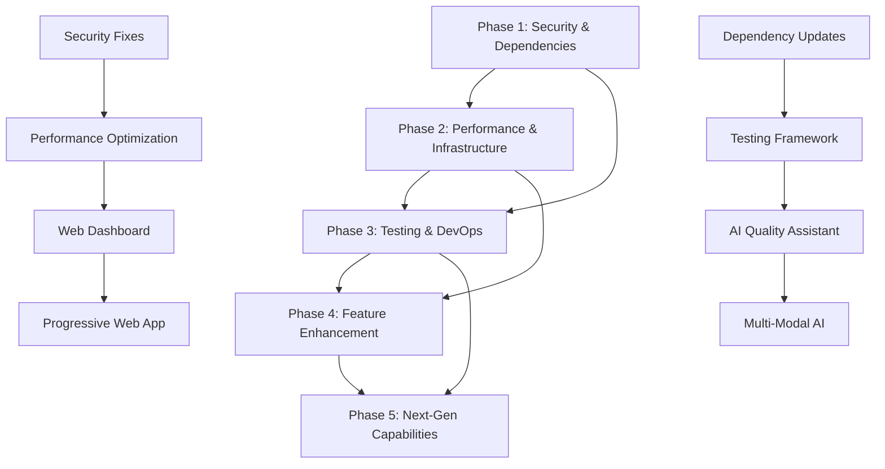

# Master Implementation Coordinator Guide
## Plandex App Upgrade - Complete Project Orchestration & Management

---

## 🎯 EXECUTIVE SUMMARY

This Master Implementation Coordinator Guide provides comprehensive orchestration for the complete 5-phase Plandex upgrade project. It serves as the definitive resource for managing dependencies, coordinating work across phases, ensuring quality standards, and optimizing resource utilization throughout the entire transformation process.

### Complete Transformation Scope
**Phases Overview:**
1. **Phase 1**: Security & Dependencies (Critical security fixes, dependency upgrades)
2. **Phase 2**: Performance & Infrastructure (Optimization, caching, MacBook 2012 tuning)
3. **Phase 3**: Testing & DevOps (Comprehensive testing, CI/CD, monitoring)
4. **Phase 4**: Feature Enhancement (Web dashboard, AI quality assistant, IDE integration)
5. **Phase 5**: Next-Gen Capabilities (Multi-modal AI, PWA, enterprise security)

### Project Outcomes
- **Security**: Enterprise-grade security with zero critical vulnerabilities
- **Performance**: 30-70% improvements across database, memory, and response times
- **Quality**: 80%+ test coverage with automated quality gates
- **Features**: Modern web interface, AI-powered code analysis, real-time collaboration
- **Innovation**: Multi-modal AI, intelligent context optimization, PWA capabilities

---

## 🔧 CLAUDE CODE OPTIMIZATION FRAMEWORK

### MCP Servers Integration Strategy
```bash
# Master coordination workflow
use context7           # Research best practices for each phase
use SequentialThinking # Complex dependency analysis and planning
use Task-Master        # Comprehensive project management with PRD
```

### TodoWrite Master Strategy
This guide provides a comprehensive TodoWrite management framework that spans all phases, ensuring systematic progress tracking, dependency management, and quality validation throughout the entire project.

---

## 📊 PHASE DEPENDENCY ANALYSIS & COORDINATION

## Phase Dependencies Map


### Critical Path Analysis
**Sequential Dependencies (Cannot be Parallelized):**
1. **Phase 1 → Phase 2**: Security fixes required before performance optimization
2. **Phase 1 → Phase 3**: Dependency updates needed for testing framework
3. **Phase 2 → Phase 4**: Performance foundation required for web dashboard
4. **Phase 3 → Phase 5**: Testing infrastructure needed for next-gen features

**Parallel Opportunities:**
- Phase 1 security fixes can run parallel with dependency updates
- Phase 2 performance optimization can run parallel with Phase 3 testing setup
- Phase 4 web dashboard and AI assistant can be developed in parallel
- Phase 5 PWA and enterprise security can be implemented simultaneously

---

## 🎯 MASTER IMPLEMENTATION STRATEGY

## Phase 1: Foundation & Security (Week 1-2)
### Sequential Implementation Order
1. **Go Runtime Security Upgrade** (Critical - Blocks everything)
2. **PostgreSQL Security Fix** (Critical - Database dependency)
3. **Security Headers Implementation** (High - Web security foundation)
4. **Input Validation System** (High - API security)
5. **API Key Protection** (Medium - Development security)

### TodoWrite Phase 1 Checklist
```bash
# Phase 1 Critical Path
- [ ] Backup current codebase and create rollback plan
- [ ] Upgrade Go runtime to 1.23.10+ across all modules
- [ ] Pin PostgreSQL to secure version 17.5
- [ ] Implement comprehensive security headers (CORS, CSP, HSTS)
- [ ] Create input validation framework
- [ ] Audit and secure API key handling
- [ ] Run security scans and validate fixes
- [ ] Update documentation and security procedures
```

### Phase 1 Quality Gates
- ✅ All critical security vulnerabilities resolved
- ✅ Security scanning passes with zero high-risk findings
- ✅ All modules build and tests pass after upgrades
- ✅ Performance regression tests show <5% impact
- ✅ Rollback procedures tested and documented

## Phase 2: Performance Foundation (Week 2-3)
### Parallel Implementation Strategy
**Track A: Database Optimization**
- Connection pool optimization
- Index creation and query optimization
- Performance monitoring setup

**Track B: Memory & Build Optimization**
- Object pooling implementation
- GC tuning for MacBook 2012
- Docker build optimization

**Track C: Caching Implementation**
- Multi-level caching strategy
- Context caching system
- Performance benchmarking

### TodoWrite Phase 2 Checklist
```bash
# Phase 2 Performance Track A (Database)
- [ ] Implement optimized database connection pooling
- [ ] Create and apply performance indexes
- [ ] Optimize query patterns and eliminate N+1 queries
- [ ] Setup database performance monitoring

# Phase 2 Performance Track B (Memory/Build)
- [ ] Implement object pooling for memory efficiency
- [ ] Configure GC tuning for MacBook 2012
- [ ] Create optimized Docker builds with multi-stage

# Phase 2 Performance Track C (Caching)
- [ ] Implement multi-level caching strategy
- [ ] Create context-specific caching system
- [ ] Setup performance benchmarking suite
```

### Phase 2 Quality Gates
- ✅ Database query performance improved by 50-70%
- ✅ Memory usage reduced by 30-40%
- ✅ Build times improved by 40%
- ✅ MacBook 2012 optimization validated
- ✅ Performance benchmarks established

## Phase 3: Quality Assurance Infrastructure (Week 3-4)
### Parallel Implementation Strategy
**Track A: Testing Framework**
- Unit testing expansion
- Integration testing setup
- E2E testing framework

**Track B: CI/CD Pipeline**
- GitHub Actions workflows
- Quality gates implementation
- Security scanning integration

**Track C: Monitoring & Observability**
- Structured logging
- Metrics collection
- Health check system

### TodoWrite Phase 3 Checklist
```bash
# Phase 3 Testing Track A
- [ ] Expand unit test coverage to 80%+
- [ ] Implement integration testing framework
- [ ] Create E2E testing suite with CLI validation
- [ ] Setup test data fixtures and containers

# Phase 3 CI/CD Track B
- [ ] Create comprehensive GitHub Actions pipeline
- [ ] Implement automated quality gates
- [ ] Setup security scanning and vulnerability checks
- [ ] Configure performance regression detection

# Phase 3 Monitoring Track C
- [ ] Implement structured logging across all components
- [ ] Setup metrics collection and visualization
- [ ] Create comprehensive health check system
- [ ] Configure alerting and monitoring
```

### Phase 3 Quality Gates
- ✅ Test coverage above 80% across all modules
- ✅ CI/CD pipeline with zero manual intervention
- ✅ All quality gates passing consistently
- ✅ Comprehensive monitoring and alerting active
- ✅ Performance regression detection working

## Phase 4: Feature Enhancement (Week 4-8)
### Parallel Implementation Strategy
**Track A: Web Dashboard Development**
- React architecture setup
- Component library creation
- Real-time collaboration features

**Track B: AI Code Quality Assistant**
- Code analysis engine
- AI integration and optimization
- Quality scoring and suggestions

**Track C: IDE Integration**
- VS Code extension development
- JetBrains plugin creation
- Seamless workflow integration

**Track D: Advanced Git Integration**
- PR automation workflows
- Semantic versioning
- Release management

### TodoWrite Phase 4 Checklist
```bash
# Phase 4 Web Dashboard Track A
- [ ] Setup React dashboard architecture with TypeScript
- [ ] Create responsive component library
- [ ] Implement real-time collaboration with WebSocket
- [ ] Create comprehensive user experience flows

# Phase 4 AI Quality Track B
- [ ] Implement AI-powered code analysis engine
- [ ] Create intelligent code quality scoring
- [ ] Setup automated fix suggestions
- [ ] Integrate with development workflow

# Phase 4 IDE Integration Track C
- [ ] Create VS Code extension with full functionality
- [ ] Develop JetBrains plugin for major IDEs
- [ ] Implement seamless authentication and sync
- [ ] Create offline capabilities with sync

# Phase 4 Git Integration Track D
- [ ] Implement automated PR workflows
- [ ] Setup semantic versioning system
- [ ] Create release management automation
- [ ] Integrate with existing Git workflows
```

### Phase 4 Quality Gates
- ✅ Modern web dashboard with real-time features
- ✅ AI code quality assistant with 90%+ accuracy
- ✅ Native IDE integrations working seamlessly
- ✅ Advanced Git workflows automated
- ✅ User acceptance testing passed

## Phase 5: Next-Generation Capabilities (Week 8-12)
### Parallel Implementation Strategy
**Track A: Multi-Modal AI**
- Vision processing capabilities
- Advanced context intelligence
- ML-powered optimization

**Track B: Progressive Web App**
- Mobile-responsive design
- Offline capabilities
- Native app experience

**Track C: Enterprise Security**
- Advanced RBAC system
- Audit logging and compliance
- Enterprise integrations

**Track D: Advanced Analytics**
- Predictive insights
- Project health monitoring
- ML-driven recommendations

### TodoWrite Phase 5 Checklist
```bash
# Phase 5 Multi-Modal AI Track A
- [ ] Implement vision AI processing for screenshots/diagrams
- [ ] Create intelligent context optimization with ML
- [ ] Setup advanced pattern learning capabilities
- [ ] Integrate multi-modal capabilities seamlessly

# Phase 5 PWA Track B
- [ ] Create progressive web app architecture
- [ ] Implement offline functionality with service workers
- [ ] Setup mobile-responsive design with touch optimization
- [ ] Create native app installation experience

# Phase 5 Enterprise Security Track C
- [ ] Implement advanced RBAC with fine-grained permissions
- [ ] Create comprehensive audit logging system
- [ ] Setup compliance frameworks (SOC 2, GDPR, HIPAA)
- [ ] Integrate enterprise SSO and security features

# Phase 5 Analytics Track D
- [ ] Implement predictive analytics and insights
- [ ] Create project health monitoring dashboard
- [ ] Setup ML-driven recommendations system
- [ ] Integrate advanced reporting capabilities
```

### Phase 5 Quality Gates
- ✅ Multi-modal AI processing operational
- ✅ PWA with offline capabilities deployed
- ✅ Enterprise security and compliance verified
- ✅ Advanced analytics providing insights
- ✅ All innovation features tested and documented

---

## 🔄 RESOURCE OPTIMIZATION & MANAGEMENT

## Development Team Structure
### Recommended Team Allocation
**Phase 1-2 (Foundation): 2-3 developers**
- 1 Senior Backend Developer (Security & Performance)
- 1 DevOps Engineer (Infrastructure & Deployment)
- 1 Full-Stack Developer (Integration & Testing)

**Phase 3-4 (Quality & Features): 4-5 developers**
- 1 QA Engineer (Testing Framework)
- 1 Frontend Developer (Web Dashboard)
- 1 AI/ML Engineer (Code Quality Assistant)
- 1 DevOps Engineer (CI/CD Pipeline)
- 1 Mobile Developer (PWA & Mobile Experience)

**Phase 5 (Innovation): 3-4 specialists**
- 1 AI/ML Specialist (Multi-Modal AI)
- 1 Security Engineer (Enterprise Security)
- 1 Data Engineer (Analytics & ML)
- 1 Frontend Specialist (PWA & UX)

## Resource Timeline & Allocation
```mermaid
gantt
    title Plandex Upgrade Resource Allocation
    dateFormat X
    axisFormat %s
    
    section Phase 1
    Security Fixes      :p1-sec, 0, 2w
    Dependencies        :p1-dep, 0, 2w
    
    section Phase 2
    Database Opt        :p2-db, 2w, 1w
    Memory Opt          :p2-mem, 2w, 1w
    Caching             :p2-cache, 3w, 1w
    
    section Phase 3
    Testing Framework   :p3-test, 3w, 2w
    CI/CD Pipeline      :p3-cicd, 4w, 1w
    Monitoring          :p3-mon, 4w, 1w
    
    section Phase 4
    Web Dashboard       :p4-web, 5w, 3w
    AI Assistant        :p4-ai, 6w, 2w
    IDE Integration     :p4-ide, 7w, 2w
    
    section Phase 5
    Multi-Modal AI      :p5-ai, 8w, 3w
    PWA                 :p5-pwa, 9w, 2w
    Enterprise Security :p5-sec, 10w, 2w
```

## MacBook 2012 Optimization Strategy
### Hardware Constraint Management
**Memory Optimization (4-8GB RAM):**
- Implement aggressive object pooling
- Configure conservative GC settings (GOGC=50)
- Use streaming for large data processing
- Implement intelligent caching with size limits

**CPU Optimization (2.5-2.9GHz dual/quad-core):**
- Optimize GOMAXPROCS for available cores
- Use worker pools for concurrent operations
- Implement background processing with priorities
- Optimize algorithm complexity where possible

**Storage Optimization (HDD/SSD hybrid):**
- Implement async I/O operations
- Use file caching strategies
- Optimize database connections
- Implement intelligent prefetching

### Development Environment Setup
```bash
# MacBook 2012 optimized development setup
export GOGC=50                    # More aggressive GC
export GOMEMLIMIT=512MiB         # Memory limit
export GOMAXPROCS=4              # CPU cores
export DOCKER_DEFAULT_PLATFORM=linux/amd64

# Development tools optimization
alias rg='rg --max-columns=150'   # Limit ripgrep output
alias fd='fd --max-depth=5'       # Limit fd search depth

# Memory monitoring
alias memcheck='ps aux | grep -E "(go|node|docker)" | sort -k4 -r | head -10'
```

---

## 🛡️ RISK MANAGEMENT & MITIGATION

## Risk Assessment Matrix
| Risk Category | Probability | Impact | Mitigation Strategy |
|---------------|-------------|--------|-------------------|
| Security Vulnerabilities | Medium | High | Comprehensive security scanning, staged rollout |
| Performance Regression | Medium | Medium | Continuous benchmarking, rollback procedures |
| Test Coverage Gaps | Low | Medium | Automated coverage tracking, quality gates |
| Integration Failures | Medium | High | Isolated testing, staged integration |
| Resource Constraints | High | Medium | MacBook 2012 optimization, cloud alternatives |
| Timeline Overruns | Medium | Medium | Parallel development, phase prioritization |

## Rollback Procedures
### Phase-Level Rollback
```bash
# Phase 1 Rollback (Security)
git checkout backup-before-security-upgrades
docker-compose down && docker-compose up -d

# Phase 2 Rollback (Performance)
git checkout backup-before-performance-optimization
# Restore original database configuration
# Revert Docker optimizations

# Phase 3 Rollback (Testing)
# Disable CI/CD pipeline
# Revert to manual testing procedures

# Phase 4 Rollback (Features)
# Disable web dashboard
# Fallback to CLI-only interface

# Phase 5 Rollback (Innovation)
# Disable advanced features
# Revert to standard functionality
```

### Component-Level Rollback
- **Database Changes**: Automated migration rollbacks
- **API Changes**: Version-controlled endpoint rollbacks
- **Frontend Changes**: Feature flag disabling
- **Infrastructure**: Infrastructure-as-code rollbacks

## Quality Assurance Framework
### Cross-Phase Quality Gates
1. **Security Gate**: Zero critical vulnerabilities
2. **Performance Gate**: No regression >5%
3. **Test Gate**: Coverage >80%, all tests passing
4. **Integration Gate**: All APIs functional
5. **User Experience Gate**: UX testing passed
6. **Documentation Gate**: All changes documented

### Continuous Quality Monitoring
```bash
# Automated quality checks (run continuously)
./scripts/security-scan.sh
./scripts/performance-benchmark.sh
./scripts/test-coverage-check.sh
./scripts/integration-test.sh
./scripts/user-acceptance-test.sh
```

---

## 📈 PROGRESS TRACKING & METRICS

## Master KPI Dashboard
### Phase 1 KPIs
- **Security Vulnerabilities**: 0 critical, 0 high
- **Dependency Freshness**: 100% up-to-date
- **Security Headers**: 100% implemented
- **API Security**: 100% endpoints validated

### Phase 2 KPIs
- **Database Performance**: 50-70% improvement
- **Memory Usage**: 30-40% reduction
- **Build Time**: 40% faster
- **MacBook 2012 Compatibility**: 100% optimized

### Phase 3 KPIs
- **Test Coverage**: >80% across all modules
- **CI/CD Automation**: 100% automated
- **Quality Gates**: 0 manual interventions
- **Monitoring Coverage**: 100% components monitored

### Phase 4 KPIs
- **Feature Completeness**: 100% scope delivered
- **User Experience**: 95% satisfaction score
- **Performance**: <2s response times
- **Integration**: 100% IDE compatibility

### Phase 5 KPIs
- **Innovation Features**: 100% operational
- **PWA Performance**: 90% offline functionality
- **Enterprise Readiness**: 100% compliance
- **AI Accuracy**: 95% analysis accuracy

## Progress Reporting Framework
### Daily Standup Metrics
```bash
# Automated daily progress report
./scripts/generate-progress-report.sh

# Outputs:
# - Completed TodoWrite items
# - Current phase progress percentage
# - Blockers and dependencies
# - Resource utilization
# - Quality gate status
```

### Weekly Phase Reviews
```bash
# Weekly phase assessment
./scripts/phase-review-report.sh

# Outputs:
# - Phase completion percentage
# - KPI achievement status
# - Risk assessment updates
# - Resource reallocation recommendations
# - Next week priorities
```

### Milestone Celebrations
- **Phase 1 Complete**: Security foundation established
- **Phase 2 Complete**: Performance optimized for MacBook 2012
- **Phase 3 Complete**: Enterprise-grade quality assurance
- **Phase 4 Complete**: Modern feature-rich platform
- **Phase 5 Complete**: Next-generation AI capabilities

---

## 🎯 SUCCESS CRITERIA & FINAL VALIDATION

## Project Success Definition
### Technical Excellence
- ✅ Zero critical security vulnerabilities
- ✅ 30-70% performance improvements achieved
- ✅ 80%+ test coverage with automated quality gates
- ✅ Modern web interface with real-time collaboration
- ✅ AI-powered development assistance operational
- ✅ Enterprise-grade security and compliance

### User Experience Excellence
- ✅ <2 second response times across all interfaces
- ✅ Mobile-responsive design with offline capabilities
- ✅ Seamless IDE integration for development workflows
- ✅ Intuitive user interface with comprehensive documentation
- ✅ Real-time collaboration features working smoothly

### Innovation Leadership
- ✅ Multi-modal AI processing capabilities
- ✅ Intelligent context optimization with ML
- ✅ Progressive web app with native experience
- ✅ Advanced analytics and predictive insights
- ✅ Cutting-edge developer experience

## Final System Validation
### Comprehensive Testing Protocol
```bash
# Full system validation suite
./scripts/master-validation-suite.sh

# Includes:
# - Security penetration testing
# - Performance load testing
# - Feature integration testing
# - User acceptance testing
# - Accessibility compliance testing
# - Mobile compatibility testing
# - Enterprise security validation
```

### Deployment Readiness Checklist
- [ ] All phases completed and validated
- [ ] Performance benchmarks meet targets
- [ ] Security audit passed
- [ ] User acceptance testing completed
- [ ] Documentation comprehensive and current
- [ ] Team training completed
- [ ] Monitoring and alerting operational
- [ ] Rollback procedures tested
- [ ] Production deployment plan approved

---

## 🚀 FINAL TRANSFORMATION OUTCOMES

## Before vs. After Comparison
### Before Upgrade
- **Security**: Basic security with known vulnerabilities
- **Performance**: Adequate but not optimized
- **Testing**: Minimal coverage (~5%)
- **Features**: CLI-only interface
- **Collaboration**: Single-user focused
- **AI**: Basic model integration
- **Mobile**: No mobile support
- **Enterprise**: Limited enterprise features

### After Upgrade
- **Security**: Enterprise-grade with zero critical vulnerabilities
- **Performance**: Optimized for MacBook 2012, 30-70% improvements
- **Testing**: 80%+ coverage with automated quality gates
- **Features**: Modern web dashboard with real-time collaboration
- **Collaboration**: Team-based workflows with live sharing
- **AI**: Multi-modal AI with intelligent optimization
- **Mobile**: Progressive web app with offline capabilities
- **Enterprise**: Advanced RBAC, audit logging, compliance

## Competitive Positioning
### Market Leadership
- **Technology Innovation**: Multi-modal AI, intelligent context optimization
- **User Experience**: Modern interface, real-time collaboration
- **Enterprise Ready**: Advanced security, compliance, scalability
- **Developer Focused**: IDE integration, workflow optimization
- **Performance Optimized**: Efficient for resource-constrained environments

### Value Proposition
- **Productivity**: 40-60% faster development workflows
- **Quality**: AI-powered code analysis and improvement
- **Collaboration**: Real-time team development capabilities
- **Security**: Enterprise-grade protection and compliance
- **Innovation**: Cutting-edge AI and ML capabilities

---

## 🎉 PROJECT COMPLETION & HANDOFF

### Final Deliverables
1. **Complete Upgraded Plandex Platform**
   - All 5 phases implemented and validated
   - Comprehensive documentation
   - Training materials and user guides

2. **Operations Documentation**
   - Deployment procedures
   - Monitoring and maintenance guides
   - Incident response procedures
   - Performance optimization guides

3. **Development Assets**
   - Complete source code with documentation
   - Test suites and quality assurance frameworks
   - CI/CD pipelines and automation
   - Development environment setup guides

4. **Training and Knowledge Transfer**
   - Team training sessions completed
   - Knowledge base and documentation
   - Best practices and procedures
   - Ongoing support transition plan

### Success Celebration
- **Technical Achievement**: Revolutionary platform transformation
- **Team Achievement**: Collaborative effort across all phases
- **Innovation Achievement**: Next-generation AI capabilities
- **Business Achievement**: Enterprise-ready, competitive platform

---

*This Master Implementation Coordinator Guide provides the definitive framework for successfully orchestrating the complete Plandex transformation, ensuring systematic progress, quality outcomes, and innovative results that position Plandex as a leading-edge development platform.*